# Сети в Linux - ОТЧЁТ

## Part 1. Инструмент **ipcalc**

**== Задание ==**

##### Поднять виртуальную машину (далее -- ws1)

#### 1.1. Сети и маски
##### Определить и записать в отчёт:
##### 1) Адрес сети *192.167.38.54/13*
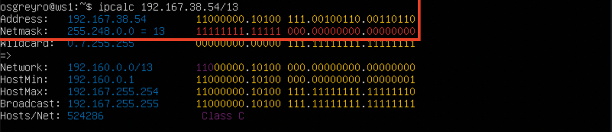

##### 2) Перевод маски *255.255.255.0* в префиксную и двоичную запись, */15* в обычную и двоичную, *11111111.11111111.11111111.11110000* в обычную и префиксную


>     ipcalc 192.167.38.54/255.255.255.0   

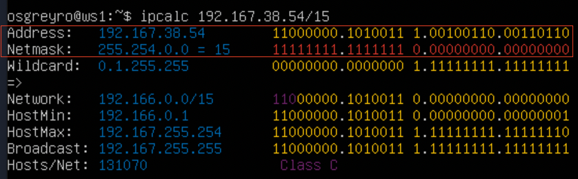

>     ipcalc 192.167.38.54/15

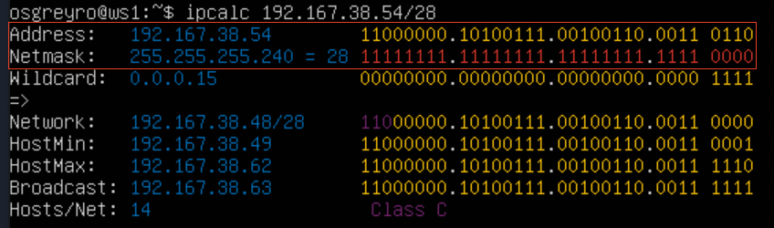

>     ipcalc 192.167.38.54/28 / преобразовали двоичную запись в читаемый для ipcalc формат (ipcalc 192.167.38.54/11111111.11111111.11111111.11110000 - выдаёт ошибку)

##### 3) Минимальный и максимальный хост в сети *12.167.38.4* при масках: */8*, *11111111.11111111.00000000.00000000*, *255.255.254.0* и */4*

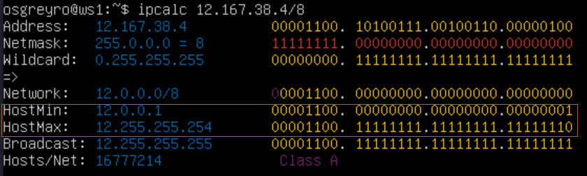

>     ipcalc 12.167.38.4/8

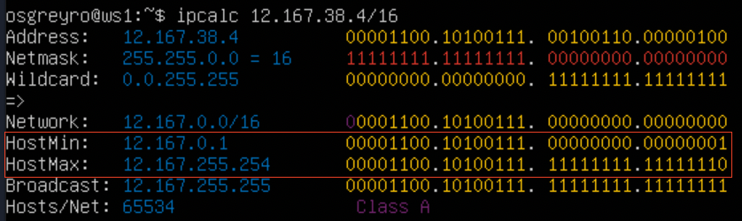

>     ipcalc 12.167.38.4/16 (11111111.11111111.00000000.00000000)

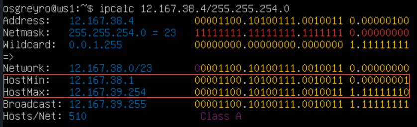

>     ipcalc 12.167.38.4/255.255.254.0

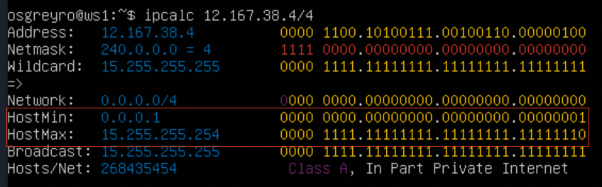

>     ipcalc 12.167.38.4/4

#### 1.2. localhost
##### Определить и записать в отчёт, можно ли обратиться к приложению, работающему на localhost, со следующими IP: *194.34.23.100*, *127.0.0.2*, *127.1.0.1*, *128.0.0.1*

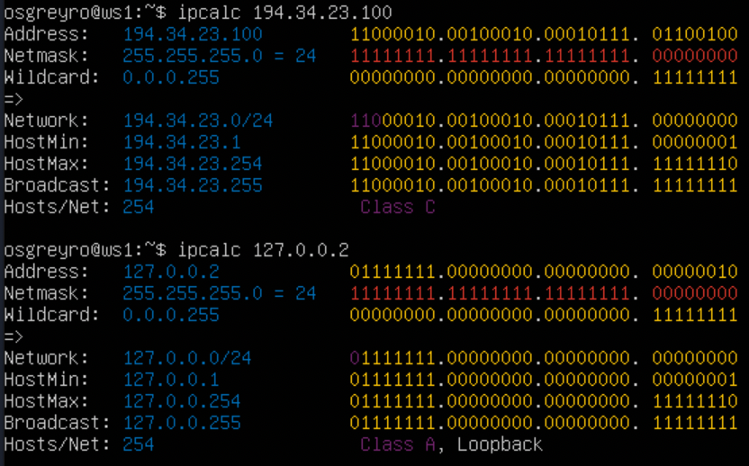

>     194.34.23.100,    нет
>     127.0.0.2,        да - возможно

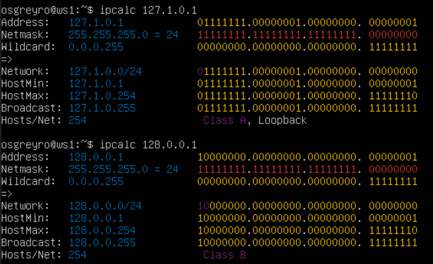

>     127.1.0.1,        да - возможно
>     128.0.0.1         нет

#### 1.3. Диапазоны и сегменты сетей
##### Определить и записать в отчёт:
##### 1) какие из перечисленных IP можно использовать в качестве публичного, а какие только в качестве частных: *10.0.0.45*, *134.43.0.2*, *192.168.4.2*, *172.20.250.4*, *172.0.2.1*, *192.172.0.1*, *172.68.0.2*, *172.16.255.255*, *10.10.10.10*, *192.169.168.1*

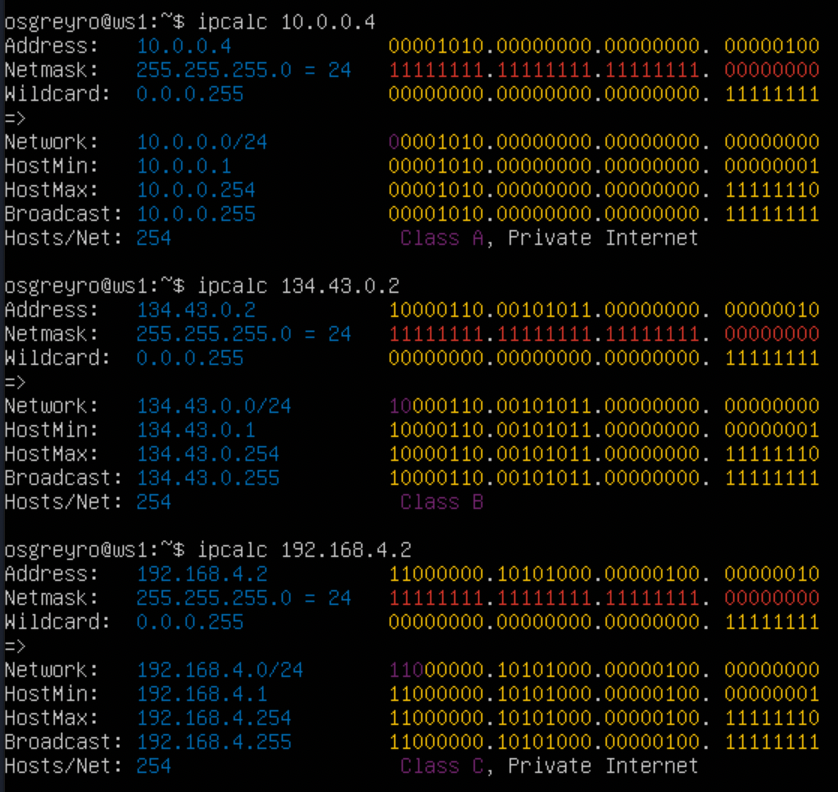

>     10.0.0.45 - privat
>     134.43.0.2 - public
>     192.168.4.2 - privat

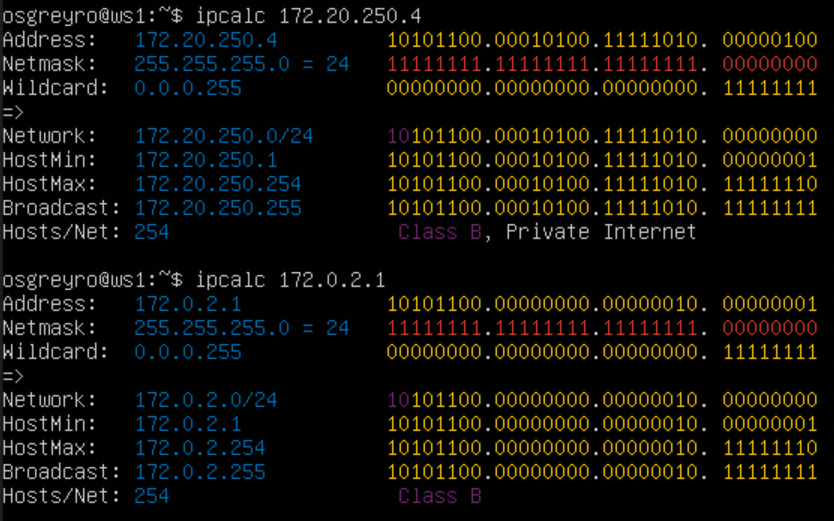

>     172.20.250.4 - privat
>     172.0.2.1 - public

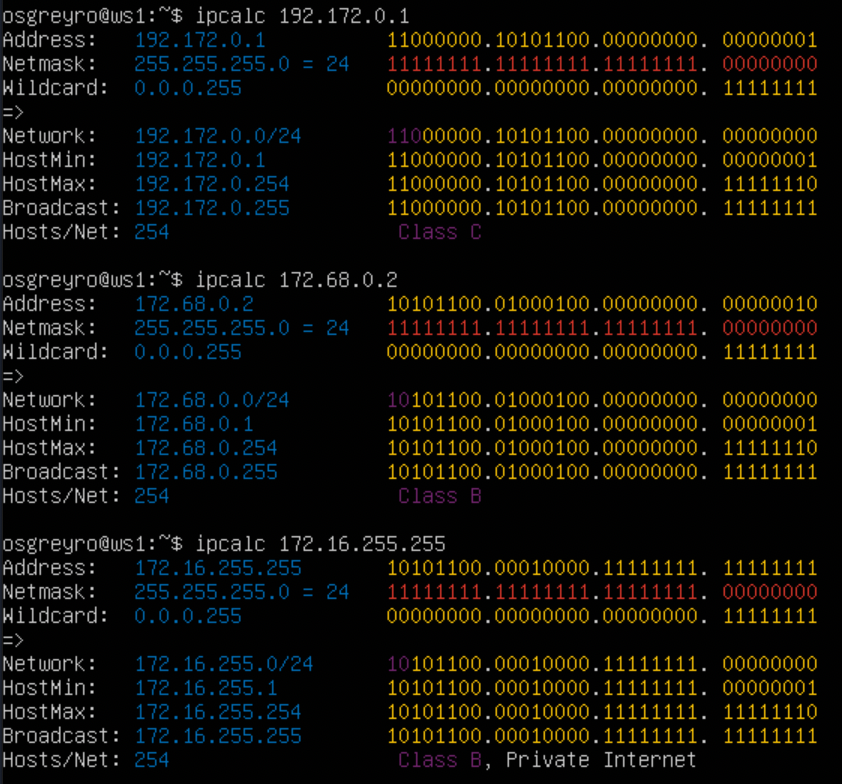

>     192.172.0.1 - public
>     172.68.0.2 - public
>     172.16.255.255 - privat


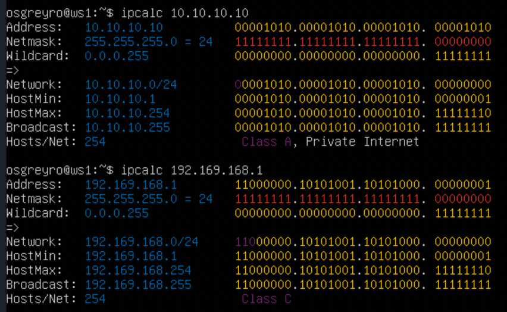

>     10.10.10.10 - privat
>     192.169.168.1 - public

##### 2) какие из перечисленных IP адресов шлюза возможны у сети *10.10.0.0/18*: *10.0.0.1*, *10.10.0.2*, *10.10.10.10*, *10.10.100.1*, *10.10.1.255*

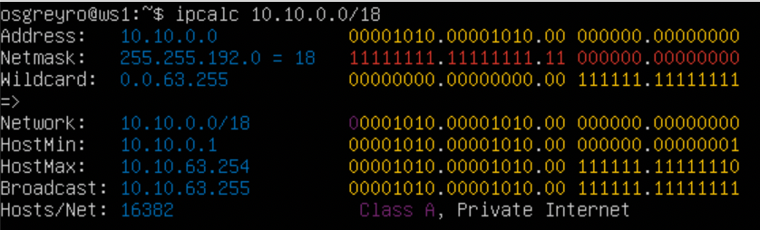

>     10.0.0.1 - нет
>     10.10.0.2 - да, возможен
>     10.10.10.10 - да, возможен
>     0.10.100.1 - нет
>     10.10.1.255 - да, возможен


## Part 2. Статическая маршрутизация между двумя машинами

**== Задание ==**

##### Поднять две виртуальные машины (далее -- ws1 и ws2)

##### С помощью команды `ip a` посмотреть существующие сетевые интерфейсы
- отчёт

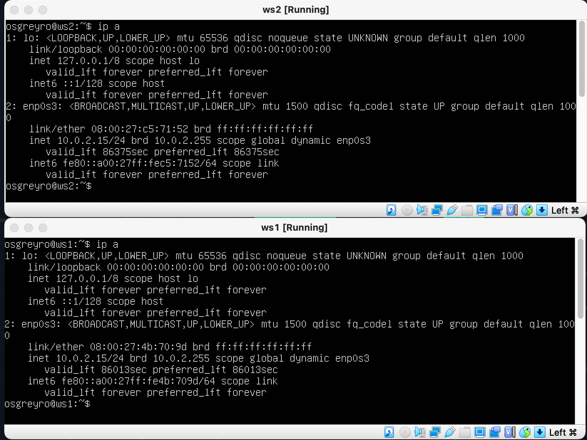

##### Описать сетевой интерфейс, соответствующий внутренней сети, на обеих машинах и задать следующие адреса и маски: ws1 - *192.168.100.10*, маска */16*, ws2 - *172.24.116.8*, маска */12*

##### Выполнить команду `netplan apply` для перезапуска сервиса сети
- отчёт 

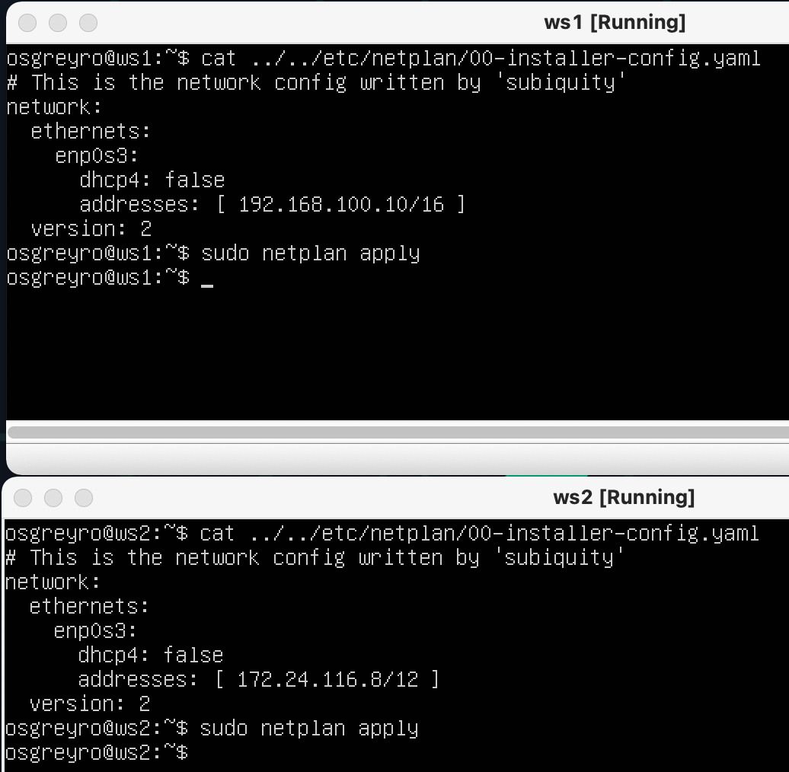

#### 2.1. Добавление статического маршрута вручную
##### Добавить статический маршрут от одной машины до другой и обратно при помощи команды вида `ip r add`
##### Пропинговать соединение между машинами
- отчёт 

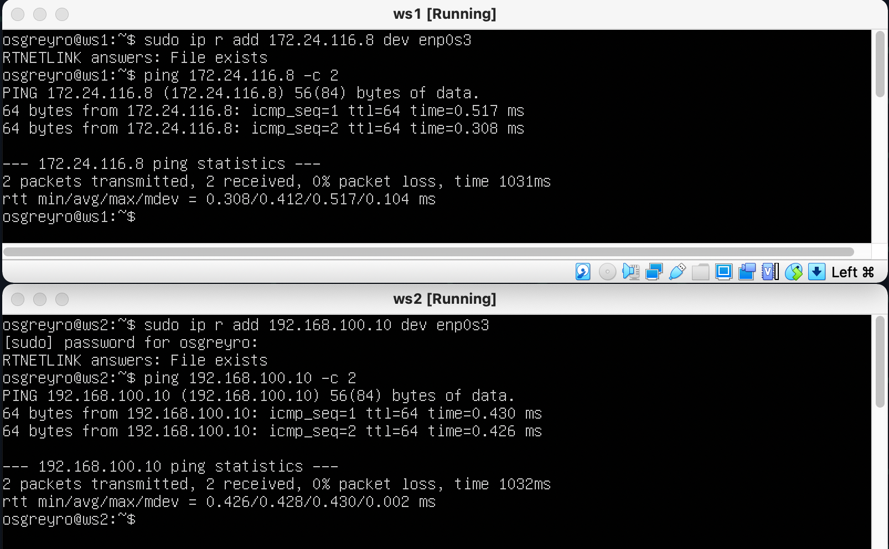

#### 2.2. Добавление статического маршрута с сохранением
##### Перезапустить машины
##### Добавить статический маршрут от одной машины до другой с помощью файла *etc/netplan/00-installer-config.yaml*
- отчёт
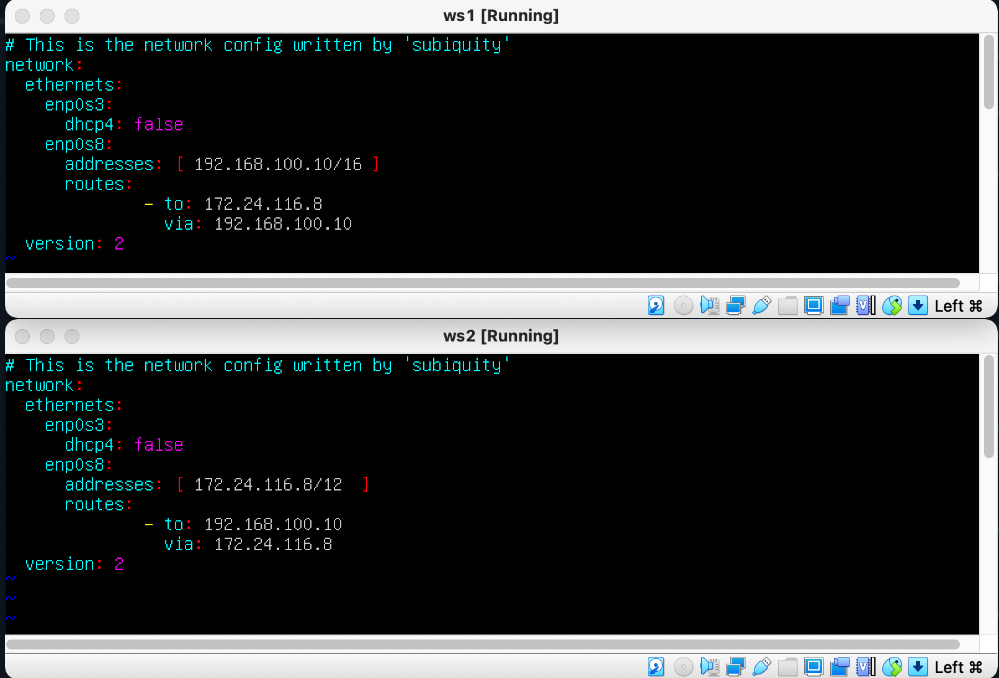

##### Пропинговать соединение между машинами
- отчёт 


## Part 3. Утилита **iperf3**

#### 3.1. Скорость соединения
##### Перевести и записать в отчёт: 8 Mbps в MB/s, 100 MB/s в Kbps, 1 Gbps в Mbps

>     8   Mbps = 1        MB/s,
>     100 MB/s = 800 000  Kbps, 
>     1   Gbps = 1 000    Mbps

#### 3.2. Утилита **iperf3**
##### Измерить скорость соединения между ws1 и ws2
- отчёт
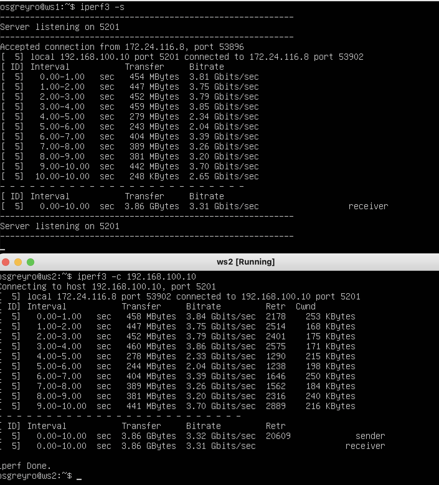

## Part 4. Сетевой экран
#### 4.1. Утилита **iptables**
##### Создать файл */etc/firewall.sh*, имитирующий фаерволл, на ws1 и ws2:

##### Нужно добавить в файл подряд следующие правила:
##### 1) на ws1 применить стратегию когда в начале пишется запрещающее правило, а в конце пишется разрешающее правило (это касается пунктов 4 и 5)
##### 2) на ws2 применить стратегию когда в начале пишется разрешающее правило, а в конце пишется запрещающее правило (это касается пунктов 4 и 5)
##### 3) открыть на машинах доступ для порта 22 (ssh) и порта 80 (http)
##### 4) запретить *echo reply* (машина не должна "пинговаться”, т.е. должна быть блокировка на OUTPUT)
##### 5) разрешить *echo reply* (машина должна "пинговаться")
- отчёт */etc/firewall* для каждой машины.
- В отчёт поместить скрины с запуском обоих файлов.
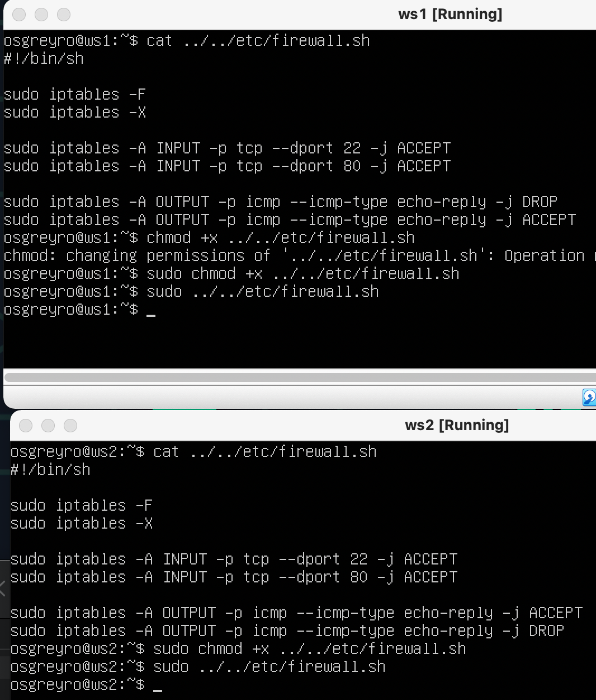

##### Запустить файлы на обеих машинах командами `chmod +x /etc/firewall.sh` и `/etc/firewall.sh`

- В отчёте описать разницу между стратегиями, применёнными в первом и втором файлах.

>     ws1 - отправляет ws2 - принимает
>     ws2 - отправил ws1 - удалил (отбросил) пакет

#### 4.2. Утилита **nmap**
##### Командой **ping** найти машину, которая не "пингуется", после чего утилитой **nmap** показать, что хост машины запущен
*Проверка: в выводе nmap должно быть сказано: `Host is up`*
- В отчёт поместить скрины с вызовом и выводом использованных команд **ping** и **nmap**.

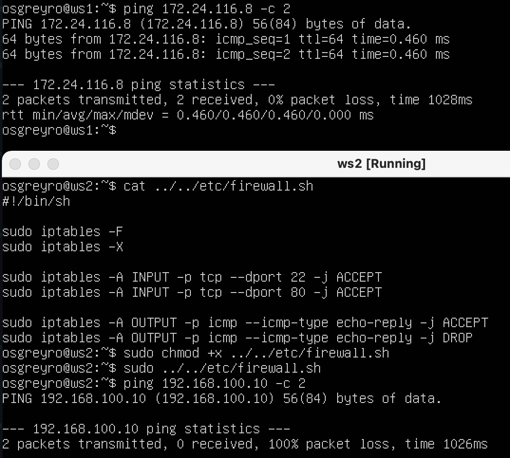

>     пинг между машинами

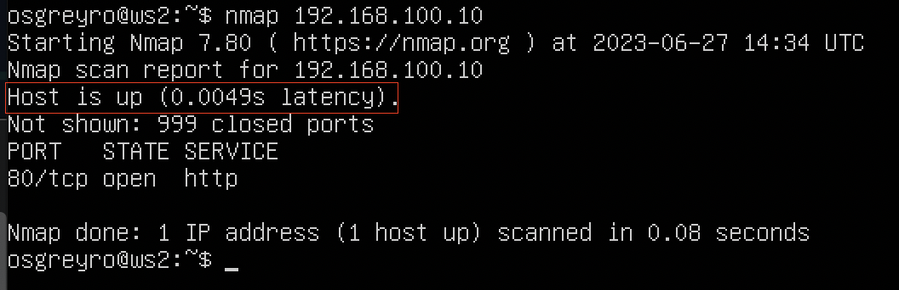

>    работа программы nmap

##### Сохранить дампы образов виртуальных машин
**p.s. Ни в коем случае не сохранять дампы в гит!**

## Part 5. Статическая маршрутизация сети


### 5.1. Настройка адресов машин 

##### Настроить конфигурации машин в *etc/netplan/00-installer-config.yaml* согласно сети на рисунке.
* Конфигурационный файл ws11
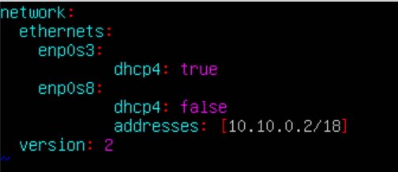

* Конфигурационный файл ws21
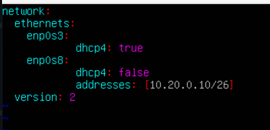
* Конфигурационный файл ws22
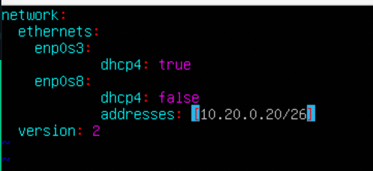

* Конфигурационный файл r1
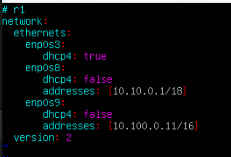

* Конфигурационный файл r2
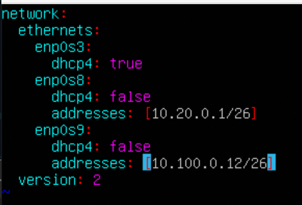


##### Перезапустить сервис сети. Если ошибок нет, то командой `ip -4 a` проверить, что адрес машины задан верно. Также пропинговать ws22 с ws21. Аналогично пропинговать r1 с ws11.

* Изображение сети
![part5_network]
* Вывод команды ip 4 -a на ws11 и ws11 -> r1.
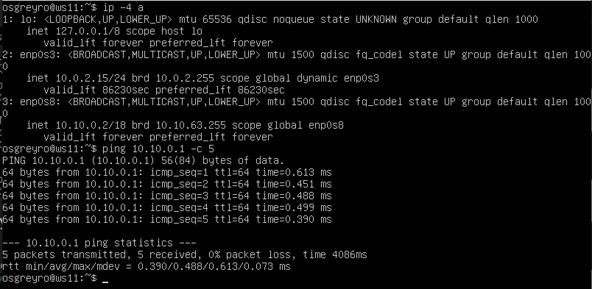

* ws21
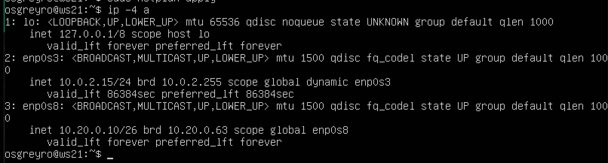


* ws22
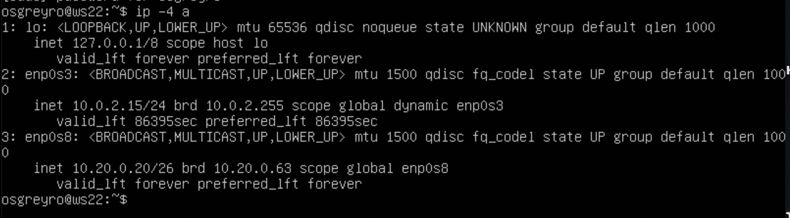
* Также пропингуем ws22 с ws21
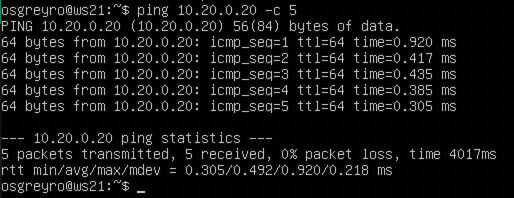

* r1
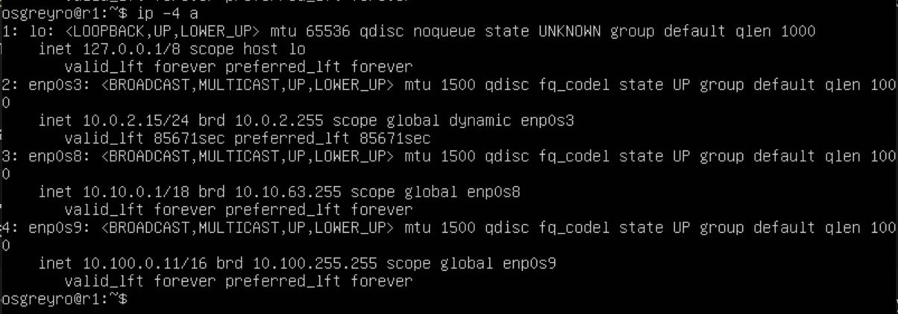
* r2
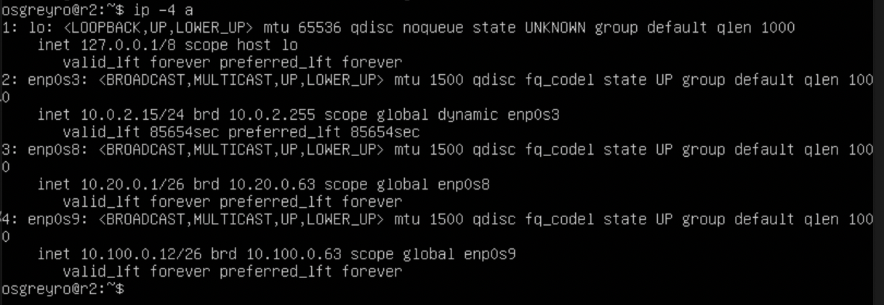

#### 5.2. Включение переадресации IP-адресов.

##### Для включения переадресации IP, выполним команду на роутерах:
`sysctl -w net.ipv4.ip_forward=1`

* на r1
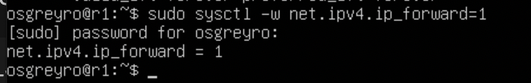

* на r2
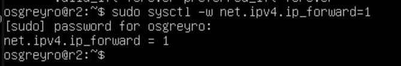

##### Откройте файл */etc/sysctl.conf* и добавьте в него следующую строку:
* Файл */etc/sysctl.conf* на r1
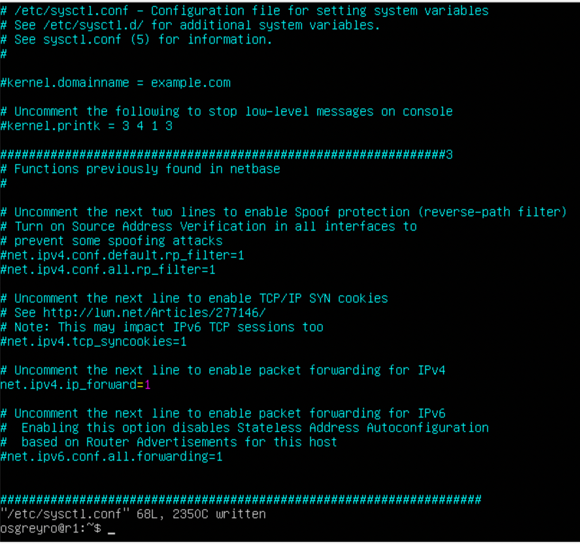
* Файл */etc/sysctl.conf* на r2
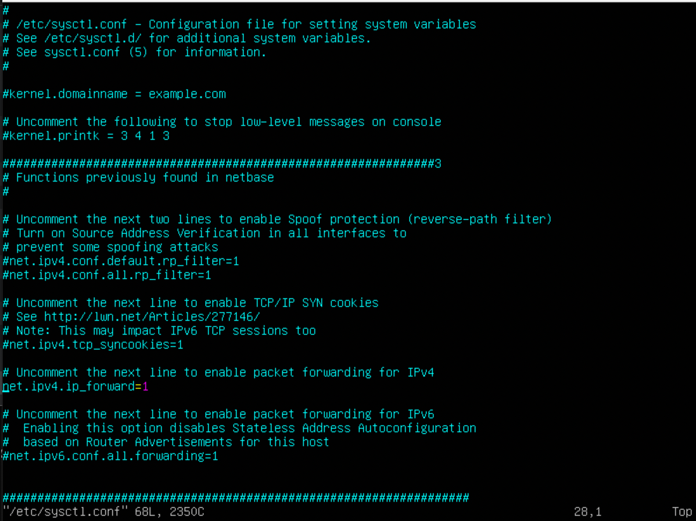
#### 5.3. Установка маршрута по-умолчанию
##### Настроить маршрут по-умолчанию (шлюз) для рабочих станций. Для этого добавить `default` перед IP роутера в файле конфигураций

* Конфиг *etc/netplan/00-installer-config.yaml* для ws11
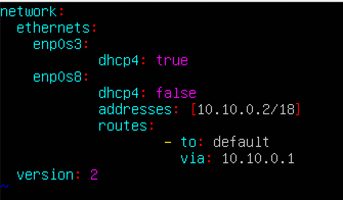
* Конфиг *etc/netplan/00-installer-config.yaml* для ws21
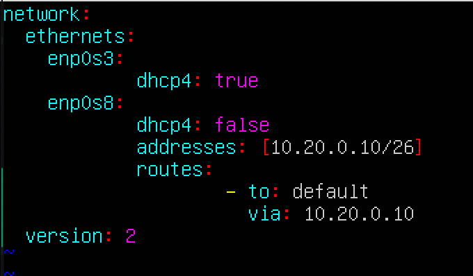
* Конфиг *etc/netplan/00-installer-config.yaml* для ws22
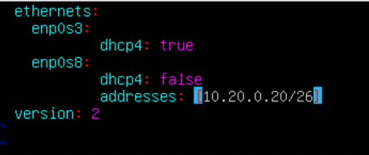
##### Вызвать `ip r` и показать, что добавился маршрут в таблицу маршрутизации

* ip r для ws11
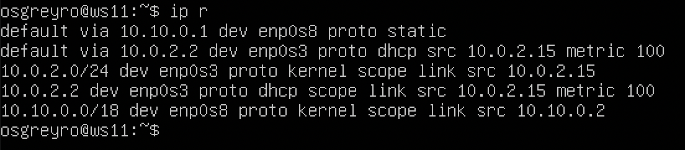
* ip r для ws21
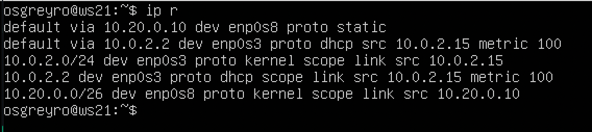
* ip r для ws22

##### Пропинговать с ws11 роутер r2 и показать на r2, что пинг доходит. Для этого использовать команду:

* Пингуем с ws11, на r2 запускаем tcpdump:
```bash
tcpdump -tn -i enp0s8
```
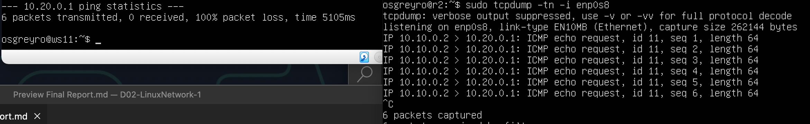
* Видим ICMP пакеты от айпишника ws11, значит пинг доходит👍👍


#### 5.4. Добавление статических маршрутов
##### Добавить в роутеры r1 и r2 статические маршруты в файле конфигураций. Пример для r1 маршрута в сетку 10.20.0.0/26:

* Статический маршрут в конфигурации r1:
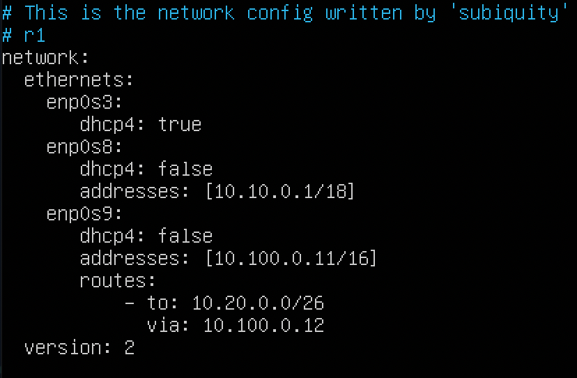

* Статический маршрут в конфигурации r2:
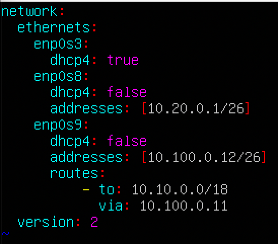

##### Вызвать `ip r` и показать таблицы с маршрутами на обоих роутерах. 
* Таблица на r1 и Таблица на r2
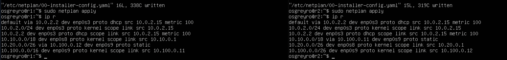


##### Запустить команды на ws11:


Адрес 0.0.0.0/0 означает "любой адрес", следовательно команда `ip r list 0.0.0.0/0` выведет все маршруты, доступные на данном устройстве. Вывод команды `ip r list 10.10.0.0/18` будет отличаться, так как данный адрес и так находится в сети устройства, и для дальнейшей передачи пакета не требуется обращение к маршрутизатору.

#### 5.5. Построение списка маршрутизаторов
* Запустим traceroute на ws11:
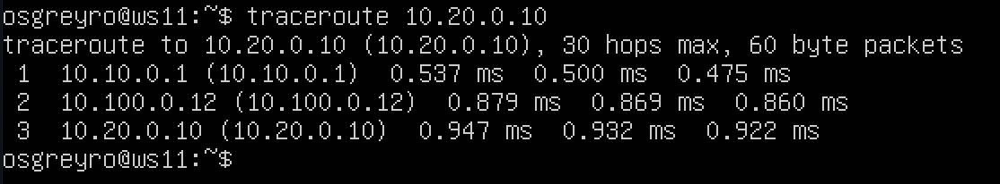
* Вывод `tcpdump -tnv -i enp0s8` на r1
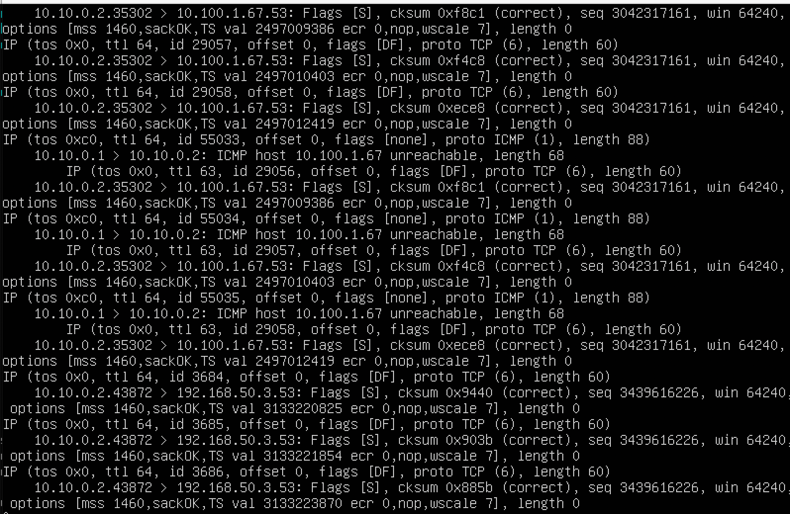

Утилита `traceroute` отправляет пакеты до нужного хоста с увеличением TTL (Time to live), пока не встретит маршрутизатор, через который проходят пакеты. Таким образом, в выводе по очереди запишутся, все маршрутизаторы по пути.

### 5.6. Использование протокола **ICMP** при маршрутизации  

##### Запустить на r1 перехват сетевого трафика, проходящего через eth0 с помощью команды:
`tcpdump -n -i eth0 icmp`

##### Пропинговать с ws11 несуществующий IP (например, *10.30.0.111*) с помощью команды:
`ping -c 1 10.30.0.111`

* Пинг на ws11 и на r1 вывод traceroute:
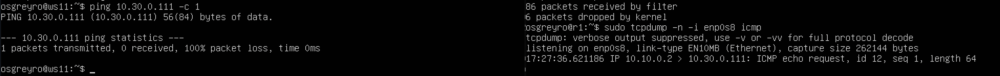

## Part 6. Динамическая настройка IP с помощью **DHCP**

##### Для r2 настроить в файле */etc/dhcp/dhcpd.conf* конфигурацию службы **DHCP**:


Установим dhcpd

```bash
sudo apt-get install isc-dhcp-server
```

* Добавим конфигурацию в файл dhcpd.conf на r2
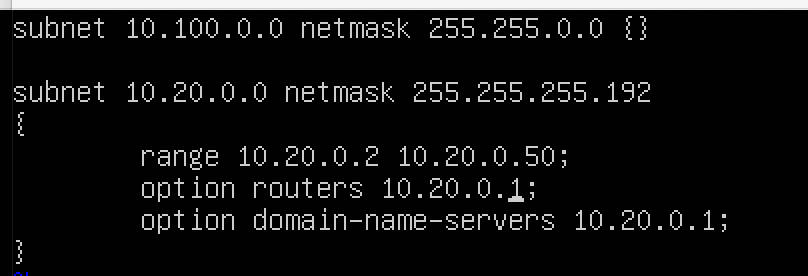

##### В файле *resolv.conf* прописать `nameserver 8.8.8.8.`

* Файл `/etc/resolv.conf` на r2
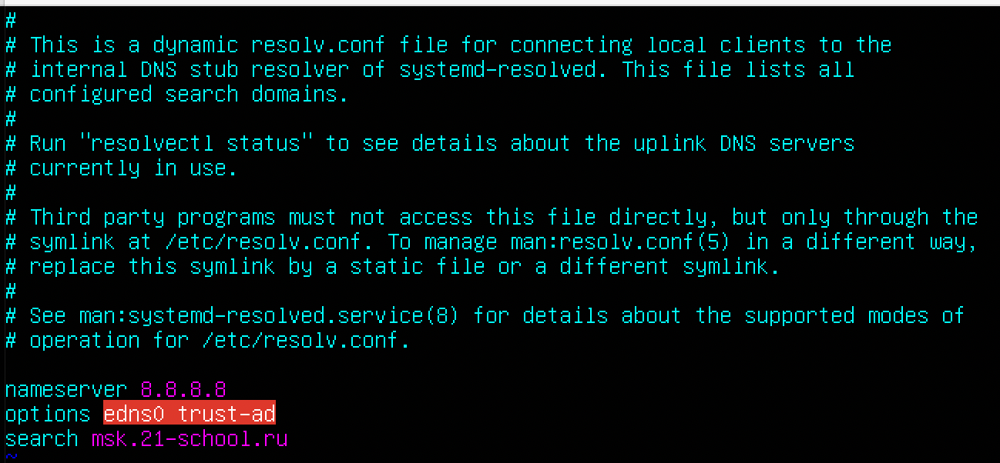
##### Перезагрузить службу **DHCP** командой `systemctl restart isc-dhcp-server`. Машину ws21 перезагрузить при помощи `reboot` и через `ip a` показать, что она получила адрес. Также пропинговать ws22 с ws21.

* Динамический адрес присвоился, ws22 пингует
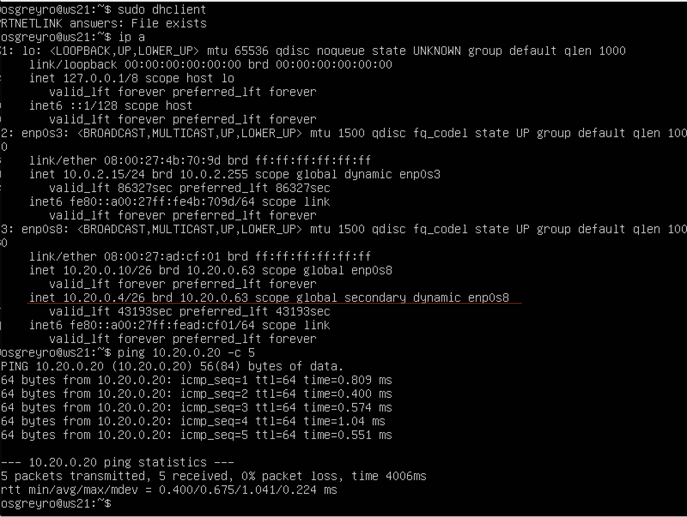
##### Указать MAC адрес у ws11, для этого в *etc/netplan/00-installer-config.yaml* надо добавить строки: `macaddress: 10:10:10:10:10:BA`, `dhcp4: true`

* измененный *etc/netplan/00-installer-config.yaml* на ws11
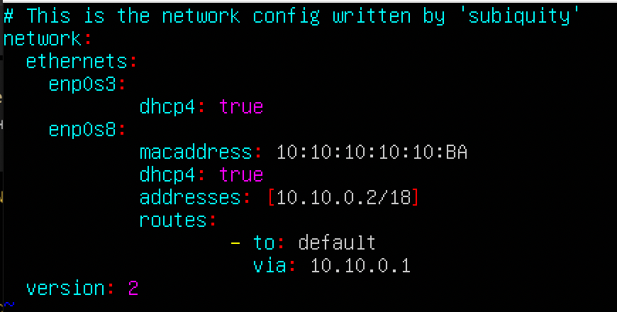

##### Для r1 настроить аналогично r2, но сделать выдачу адресов с жесткой привязкой к MAC-адресу (ws11). Провести аналогичные тесты

* Конфигурация dhcpd на r1.
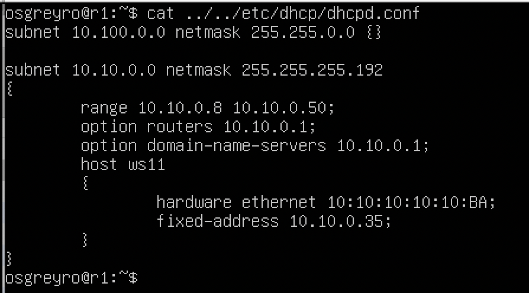

* После ребута на ws11 появился наш ip который мы жестко задали в конфиге r1.
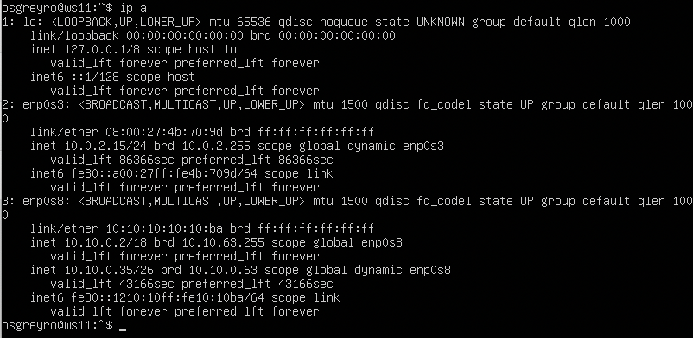

##### Запросить с ws21 обновление ip адреса

* ip a до смены динамического адреса
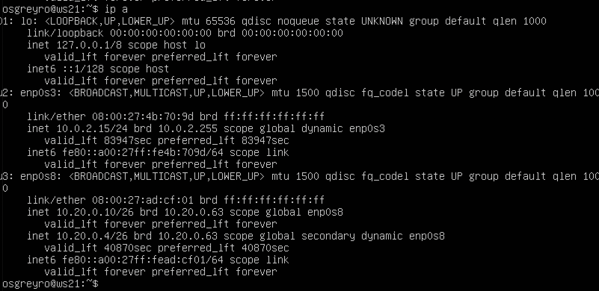
* запустим `dhclient`. Адрес поменялся

##### В отчёте описать, какими опциями **DHCP** сервера пользовались в данном пункте.

В данном пункте использовались такие опции dhcp сервера, как **dhclient** - для получения нового ip-адреса на машину, использовали динамическую выдачу ip-адресов на машины, что и является главной опцией dhcp-сервера, выдачу ip-адресов c привязкой по MAC-адресу, что не позволит хосту с таким же именем получить ip-адрес, предназначенный описанному в конфигурационном файле.

## Part 7. **NAT**

##### В файле */etc/apache2/ports.conf* на ws22 и r1 изменить строку `Listen 80` на `Listen 0.0.0.0:80`, то есть сделать сервер Apache2 общедоступным
##### Запустить веб-сервер Apache командой `service apache2 start` на ws22 и r1
- отчёт
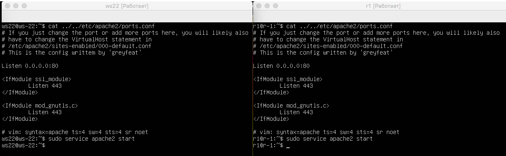

##### Добавить в фаервол, созданный по аналогии с фаерволом из Части 4, на r2 следующие правила:
##### 1) Удаление правил в таблице filter - `iptables -F`
##### 2) Удаление правил в таблице "NAT" - `iptables -F -t nat`
##### 3) Отбрасывать все маршрутизируемые пакеты - `iptables --policy FORWARD DROP`
##### Запускать файл также, как в Части 4
##### Проверить соединение между ws22 и r1 командой `ping`
*При запуске файла с этими правилами, ws22 не должна "пинговаться" с r1*
- отчёт
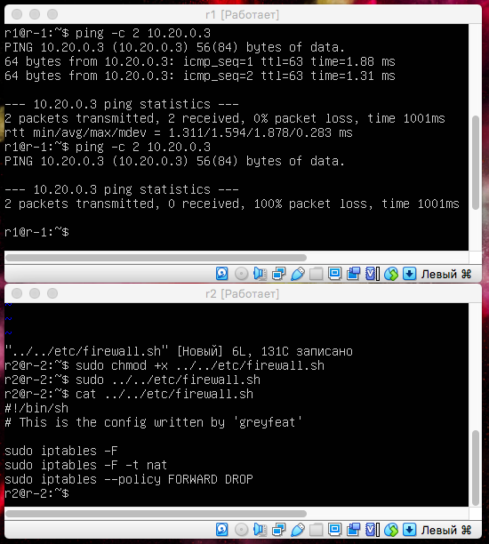

##### Добавить в файл ещё одно правило:
##### 4) Разрешить маршрутизацию всех пакетов протокола **ICMP**
##### Запускать файл также, как в Части 4
##### Проверить соединение между ws22 и r1 командой `ping`
*При запуске файла с этими правилами, ws22 должна "пинговаться" с r1*
- отчёт
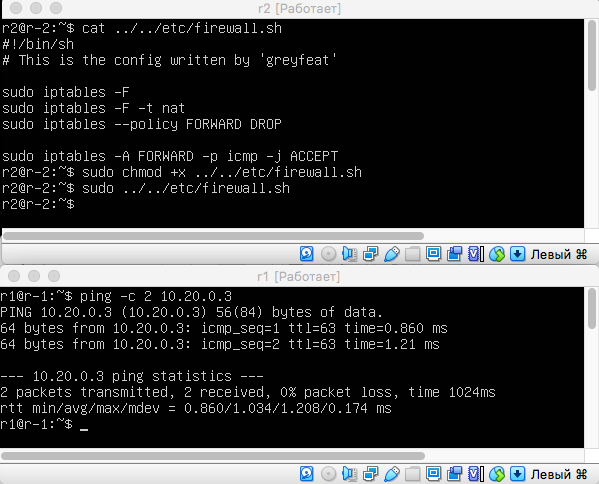

##### Добавить в файл ещё два правила:
##### 5) Включить **SNAT**, а именно маскирование всех локальных ip из локальной сети, находящейся за r2 (по обозначениям из Части 5 - сеть 10.20.0.0)

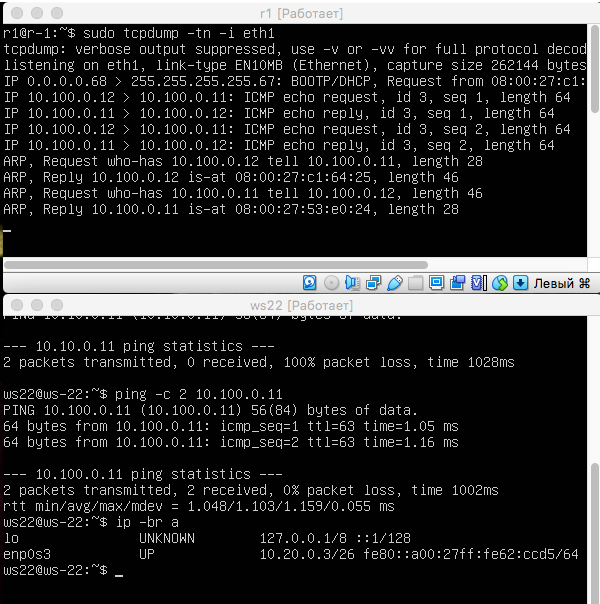

##### 6) Включить **DNAT** на 8080 порт машины r2 и добавить к веб-серверу Apache, запущенному на ws22, доступ извне сети
*Совет: стоит учесть, что при попытке подключения возникнет новое tcp-соединение, предназначенное ws22 и 80 порту*
- В отчёт 


##### Запускать файл также, как в Части 4
*Перед тестированием рекомендуется отключить сетевой интерфейс **NAT** (его наличие можно проверить командой `ip a`) в VirtualBox, если он включен*
##### Проверить соединение по TCP для **SNAT**, для этого с ws22 подключиться к серверу Apache на r1 командой:
`telnet [адрес] [порт]`
##### Проверить соединение по TCP для **DNAT**, для этого с r1 подключиться к серверу Apache на ws22 командой `telnet` (обращаться по адресу r2 и порту 8080)
- отчёт
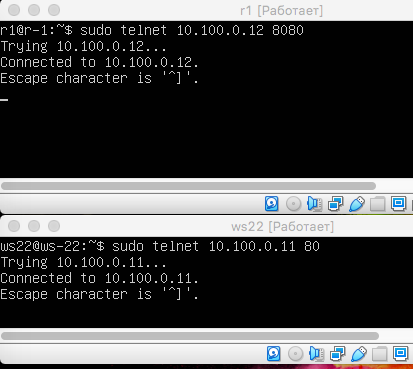

##### Сохранить дампы образов виртуальных машин
**p.s. Ни в коем случае не сохранять дампы в гит!**

## Part 8. Дополнительно. Знакомство с **SSH Tunnels**

*В данном задании используются виртуальные машины из Части 5*

##### Запустить на r2 фаервол с правилами из Части 7
##### Запустить веб-сервер **Apache** на ws22 только на localhost (то есть в файле */etc/apache2/ports.conf* изменить строку `Listen 80` на `Listen localhost:80`)
##### Воспользоваться *Local TCP forwarding* с ws21 до ws22, чтобы получить доступ к веб-серверу на ws22 с ws21
##### Воспользоваться *Remote TCP forwarding* c ws11 до ws22, чтобы получить доступ к веб-серверу на ws22 с ws11
##### Для проверки, сработало ли подключение в обоих предыдущих пунктах, перейдите во второй терминал (например, клавишами Alt + F2) и выполните команду:
`telnet 127.0.0.1 [локальный порт]`
- отчёт

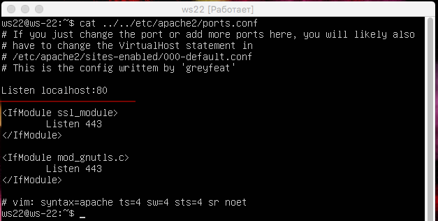

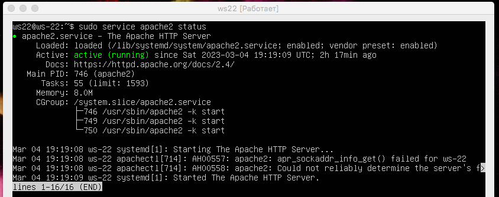 

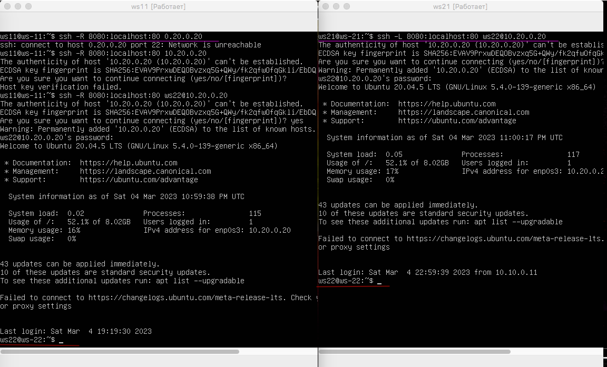 

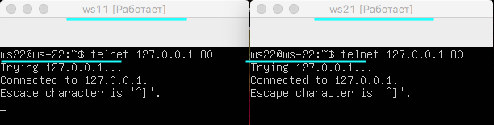
